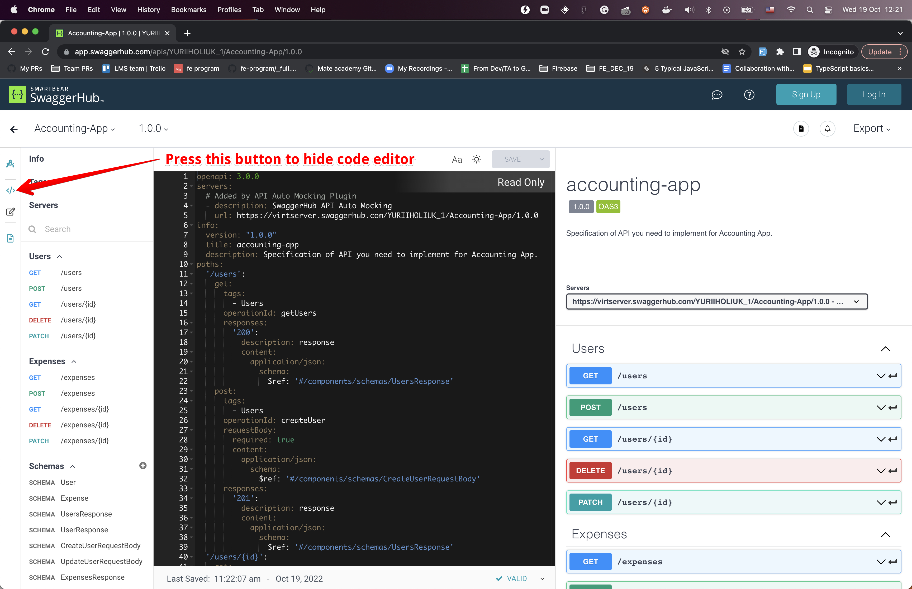
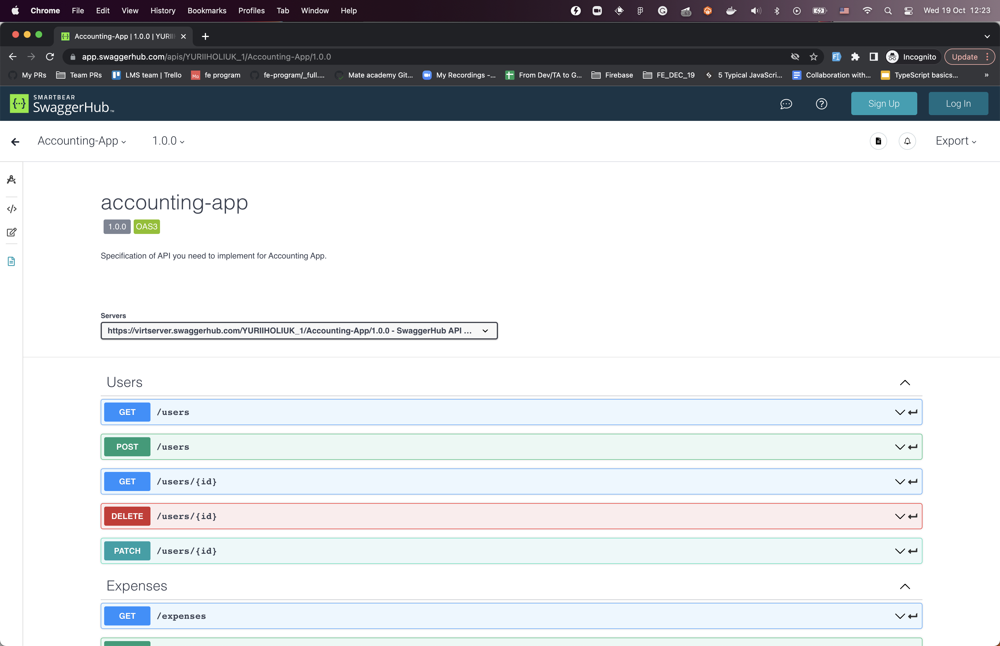

# Accounting app (with Node.js)

Implement an expense tracking app.
You need to implement 2 collections with 5 endpoints each.

## Business requirements
They are well-described in a [documentation](https://app.swaggerhub.com/apis/YURIIHOLIUK_1/Accounting-App/1.0.0)

  
How to work with documentation

  If you open endpoint you will see request params, body. As well as expected response.
  Also, you can use `Try it out` and then `Execute` button to send the request to the mock server.
  It will send you demo response.

  You can hide unneeded code editor:
  
  Result:
  

## Technical requirements

Additional to positive cases you for every request you should:
- return 404 with any message if expected entity doesn't exist.
- return 400 with any message if required parameter is not passed.

This behavior described in tests (expected and checked by tests).

Data should be empty initially. Store data in memory (just in code in some variable).
Changes should be persistent while server is working.
It means, if I create expense in the first POST request it should be returned in the second GET request.

But after stop/start server again data should be empty.

### Code requirements
You have to work inside `src/createServer.js`.
You should create, set up and return an express app from `createServer` function.
> ❗️You shouldn't call `app.listen(...)`. I's done in tests and in the `main.js`
You might create additional files and might not, but no one can guarantee approve by mentor 😉.

## How to work
- `npm run dev` - to start server with auto-restart on code change.
- `npm start` - just starts the server.
- `npm run test:watch` - **[Recommended]** runs tests in watch mode (rerun them automatically on change).
- `npm test` - runs ESLint and tests once.
- `npm run lint` - runs ESLint.
- `npm run lint:fix` - runs ESLint and fix fixable errors.
